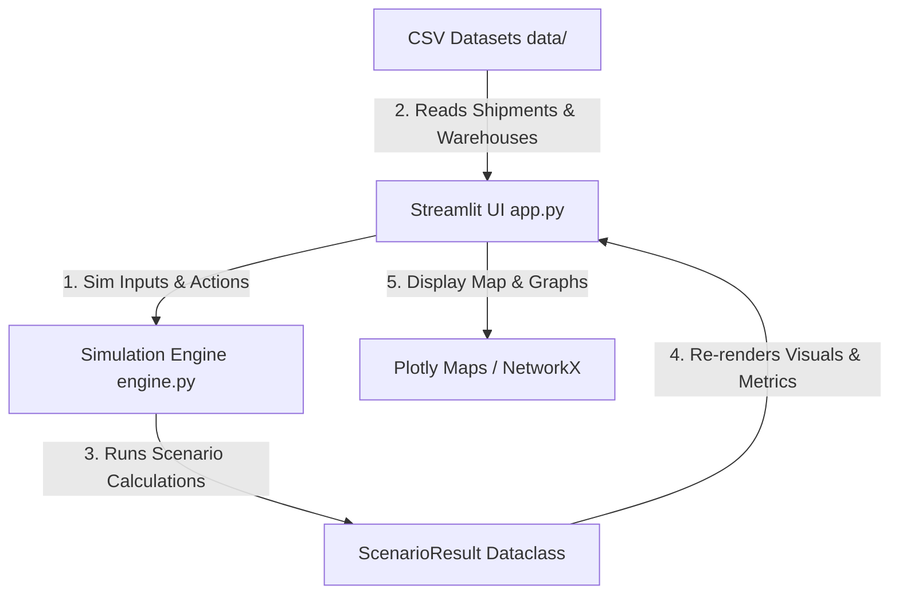

# SCDI – Supply Chain Disruption Intelligence Technology Stack

**SCDI (Supply Chain Disruption Intelligence)** is built as a lightweight, interactive decision-intelligence application for supply chain control tower operations. Below is a detailed breakdown of the components in the technology stack and the rationale behind their selection.

### 1. **Core Language & Environment**
- **Python (>= 3.10)**: The base language of the application. Python was chosen for its mature ecosystem in data science, easy integration with visualization libraries, and rapid development capabilities for MVP/hackathon environments.

### 2. **User Interface Framework**
- **[Streamlit](https://streamlit.io/) (>= 1.35)**:
  - **Purpose**: Powering the frontend control tower, simulator, and copilot chat views.
  - **Why it's used**:
    - Streamlit allows Python developers to build interactive, stateful web applications without writing separate frontend JavaScript/HTML/CSS code.
    - It supports hot-reloading out-of-the-box, simplifying dynamic prototyping.
    - Integrated native elements (like sliders, metrics columns, dataframes, and chatbots) provide a modern design directly from Python code.
    - Supports embedding HTML/CSS via `unsafe_allow_html=True`, which is utilized to inject custom CSS styles (e.g., hero cards, custom dashboard styles).

### 3. **Data Manipulation & Analysis**
- **[Pandas](https://pandas.pydata.org/) (>= 2.0)**:
  - **Purpose**: In-memory data storage, querying, and filtering.
  - **Why it's used**:
    - Loads and manages CSV data for shipments ([shipments.csv](file:///c:/Users/utkar/OneDrive/Desktop/LogiMind_AI/data/shipments.csv)) and warehouses ([warehouses.csv](file:///c:/Users/utkar/OneDrive/Desktop/LogiMind_AI/data/warehouses.csv)).
    - Handles sorting, filtering, and statistical aggregations (e.g., average delay hours, active shipment counts, and calculating values-at-risk) efficiently.
- **[NumPy](https://numpy.org/) (>= 1.24)**:
  - **Purpose**: Supporting numerical operations.
  - **Why it's used**:
    - Pandas internally relies on NumPy arrays for fast vectorized operations.

### 4. **Visualizations & Mapping**
- **[Plotly](https://plotly.com/) (>= 5.20)**:
  - **Purpose**: Plotting interactive geographic routes and network dashboards.
  - **Why it's used**:
    - Provides high-performance, interactive data visualizations.
    - Specifically leverages `go.Scattermapbox` to render route lines between origins and destinations over a map backdrop, enabling immediate visual feedback on shipment status and geographical risk.
    - Enables custom styling matching the dark theme of the dashboard.

### 5. **Network Topology & Graph Modeling**
- **[NetworkX](https://networkx.org/) (>= 3.2)**:
  - **Purpose**: Modeling the supply chain network as a graph structure.
  - **Why it's used**:
    - Enables modeling of entities (Suppliers, Hubs, Customers) as nodes and their shipping lanes as edges.
    - Facilitates calculating network connectivity and analyzing the downstream impact when nodes (such as the Chennai Hub) fail.

### 6. **Relational Database & Backend Storage**
- **[PostgreSQL](https://www.postgresql.org/)**:
  - **Purpose**: Persisting structured supply chain transactions and real-time logs.
  - **Why it's used**:
    - Stores structured relational tables for `shipments`, `warehouses`, `orders`, and `vehicles`.
    - Enables complex relation tracking (e.g., mapping user orders to transit vehicles and their GPS routes).
- **[psycopg2-binary](https://pypi.org/project/psycopg2-binary/)**:
  - **Purpose**: Python adapter for PostgreSQL.
  - **Why it's used**:
    - Facilitates connection pools and query execution directly from python modules ([db_setup.py](file:///c:/Users/utkar/OneDrive/Desktop/LogiMind_AI/db_setup.py) and [order_agent.py](file:///c:/Users/utkar/OneDrive/Desktop/LogiMind_AI/order_agent.py)).

### 7. **AI Agent Orchestration & NLP**
- **[LangGraph](https://github.com/langchain-ai/langgraph) & [LangChain Core](https://github.com/langchain-ai/langchain)**:
  - **Purpose**: Implementing stateful conversation graphs for the AI Copilot.
  - **Why it's used**:
    - Defines a cyclical state machine (`AgentState`) to classify user natural language intent (e.g., querying order ETA vs. delay reason).
    - Translates user intent into dynamic SQL queries, queries the database, and processes outputs back into human-friendly explanations.

---

## Architecture Flow

The system operates as a reactive application where changes to parameters in the UI trigger simulation updates in the backend:

* **Interactive Control Tower**: Displays live KPI metrics (Active Shipments, Value at Risk, Network SLA) using Pandas aggregations and Plotly maps.
* **What-If Simulator**: Utilizes [engine.py](file:///c:/Users/utkar/OneDrive/Desktop/LogiMind_AI/engine.py#L30) (`simulate`) to adjust delay risk parameters (weather, traffic, warehouse load) and instantly see impacts.
* **AI Copilot**: Uses standard rule-based parsing (`answer_copilot` in `engine.py`) to answer plain-text supply chain questions and recommend actions.
